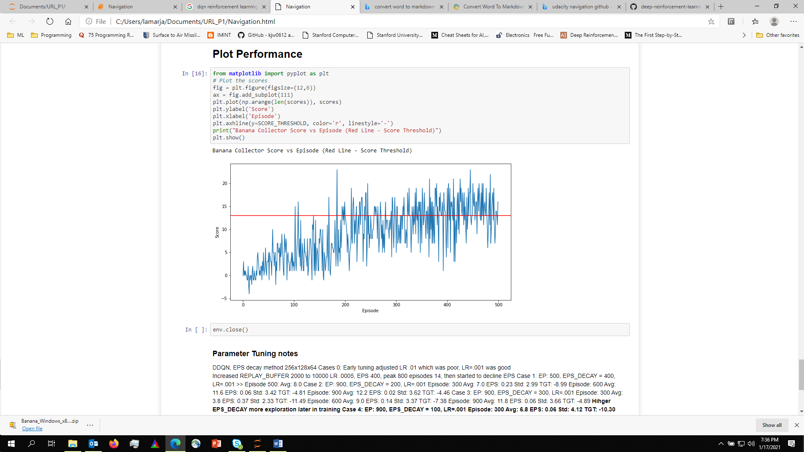

# Project 1: Navigation
### **Introduction**
For this project, you will train an agent to navigate (and collect bananas!) in a large, square world.

A reward of +1 is provided for collecting a yellow banana, and a reward of -1 is provided for collecting a blue banana. Thus, the goal of your agent is to collect as many yellow bananas as possible while avoiding blue bananas.

The state space has 37 dimensions and contains the agent's velocity, along with ray-based perception of objects around agent's forward direction. Given this information, the agent has to learn how to best select actions. Four discrete actions are available, corresponding to:

- **0** - move forward.
- **1** - move backward.
- **2** - turn left.
- **3** - turn right.

The task is episodic, and in order to solve the environment, your agent must get an average score of +13 over 100 consecutive episodes.
### **Description of the Banana Collector Environment** 
Source: [Udacity DeepRL project 1: Navigation - Full post :: Gregor the coding cat — A blog about CS stuff (wpumacay.github.io)](https://wpumacay.github.io/research_blog/posts/deeprlnd-project1-navigation/#1-description-of-the-banana-collector-environment) ]

Banana Collector Environment has a single agent that can move in a planar arena, with observations given by a set of distance-based sensors and some intrinsic measurements, and actions consisting of 4 discrete commands.

Bananas have two categories: yellow bananas, which give the agent a reward of +1, and purple bananas, which give the agent a reward of -1.

The task is episodic, with a maximum of 300 steps per episode.

The observations the agent gets from the environment come from the agent's linear* velocity in the plane *(2* entries), and a set of 7 ray perceptions. These ray perceptions consist of rays shot in certain fixed directions from the agent. *Each of these* *perceptions returns a* vector of 5 entries each, whose values are explained below:

The first 4 entries consist of a one-hot encoding of the type of object the ray hit, and these could either be a yellow banana, a purple banana, a wall or nothing at all. 

The 35 dimensions of ray-based perception of objects around the agent’s forward direction and 2 dimensions of velocity. The 35 dimensions of ray perception are broken down as: 7 rays projecting from the agent at the following angles (and returned back in the same order): [20, 90, 160, 45, 135, 70, 110] where 90 is directly in front of the agent. Each ray is 5 dimensional and it projected onto the scene. If it encounters one of four detectable objects (i.e. yellow banana, wall, blue banana, agent), the value at that position in the array is set to 1. There is a distance measure which is a fraction of the ray length. Each ray is [Yellow Banana, Wall, Blue Banana, Agent, Distance].  The velocity of the agent is two dimensional: left/right velocity (usually near 0) and forward/backward velocity (0 to 11.2).The last entry consist of the percent of the ray length at which the object was found. If no object is found at least at this maximum length, then the 4th entry is set to 1, and this entry is set to 0.0.

Below there are two separate cases that show the ray-perceptions. The first one to the left shows all rays reaching at least one object (either purple banana, yellow banana or a wall) and also the 7 sensor readings in array form (see the encodings in the 4 first entries do not contain the none found case). The second one to the right shows all but one ray reaching an object and also the 7 sensor readings in array form (see the encodings in the 4 first entries do include the ‘none’ found case for the 4th perception).

 Agent ray-perceptions. a) 7 rays reaching at least one object (banana or wall). b) One ray reaching the max. length before reaching any object   
### **Getting Started**
Download the environment from one of the links below. You need only select the environment that matches your operating system:

- Linux: [click here](https://s3-us-west-1.amazonaws.com/udacity-drlnd/P1/Banana/Banana_Linux.zip)
- Mac OSX: [click here](https://s3-us-west-1.amazonaws.com/udacity-drlnd/P1/Banana/Banana.app.zip)
- Windows (32-bit): [click here](https://s3-us-west-1.amazonaws.com/udacity-drlnd/P1/Banana/Banana_Windows_x86.zip)
- Windows (64-bit): [click here](https://s3-us-west-1.amazonaws.com/udacity-drlnd/P1/Banana/Banana_Windows_x86_64.zip)

(*For Windows users*) Check out [this link](https://support.microsoft.com/en-us/help/827218/how-to-determine-whether-a-computer-is-running-a-32-bit-version-or-64) if you need help with determining if your computer is running a 32-bit version or 64-bit version of the Windows operating system.

1. Get the file in the in the p1\_navigation/ folder, and unzip (or decompress) the file.
1. Requirements
- tensorflow==1.7.1
- Pillow>=4.2.1
- matplotlib
- numpy>=1.11.0
- jupyter
- pytest>=3.2.2
- docopt
- pyyaml
- protobuf==3.5.2
- grpcio==1.11.0
- torch==0.4.0
- pandas
- scipy
- ipykernelx
### **Instructions**
Follow the instructions in Navigation.ipynb to get started with training your own agent. The notebook starts with a sample of the environment and API. It is followed by the implementation of a DQN algorithm. The algorithm has been trained and weights are stored in model.pt

Section: ***Create Banana Collector Unity Environment***, sets up the unity environment.

Section: ***Parameters***, is where configuration and hyper parameters are updated. The FC1, FC2, FC3 control the nodes for the model’s hidden layers

*#Environment parameters*

*#state\_size = 37*

*#action\_size = 4*

*#Model hidden layer nodes*

FC1 = 512

FC2 = 1024

FC3 = 128

*#Replay Buffer*

BUFFER\_SIZE = 100000     *# Replay buffer size, 300 steps per episode*  

BATCH\_SIZE = 32         *# Batch size*  

*#Learning Parameters*

GAMMA = 0.995           *# Discount gamma factor*  

TAU = .001              *# Soft update of target parameters*

LR = 0.0001             *# learning rate* 

REPLAY\_INTERVAL = 4     *# How often replay implemented*

EPS\_START = .998        *# Starting epsilon, for epsilon-greedy action selection*

EPS\_END = 0.03          *# Minimum value of epsilon*

EPS\_DECAY = 0.980       *# Factor per episode decreasing epsilon*

EPISODES\_MAX = 900      *# Maximum number of training episodes, stop earlier if score >13, 100 runs*

*#Other*

SEED = 64               *# Allow for repeatability*

EPISODE\_PRINT = 10      *# Control interval of printing score during training*

SCORE\_WINDOW\_SIZE = 100 *# Window size to calculate consecutive episode window averages*

SCORE\_THRESHOLD = 13.0  *# Score threshold selected for trained agent for this game*

*#Run on GPU or CPU*

**import** **torch**

**if** torch.cuda.is\_available():

`    `device = torch.device('cuda')

**else**:

`    `device = torch.device('cpu')

Section: ***Define Deep Q Model***

Model network is a fully Connected Linear Network Input: States = 37 Hidden Layers: = 3 ; Defined by FC1, FC2, FC3 Output: Actions =4. The input is not pre-process and connects to the first of three layers. The 3 hidden layers output RELU function. The last layer has the 4 action outputs, with no output function.

**import** **torch.nn** **as** **nn**

**import** **torch.nn.functional** **as** **F**

**from** **torch.autograd** **import** Variable

*#Linear Network, 3 Hidden Layers, input:state\_size , output: action\_size*

**class** **DQN\_Model**(nn.Module):

`    `**def** \_\_init\_\_(self):  

`        `super(DQN\_Model, self).\_\_init\_\_()

`        `self.seed = torch.manual\_seed(SEED)

`        `self.fc1 = nn.Linear(state\_size, FC1)

`        `self.fc2 = nn.Linear(FC1, FC2)

`        `self.fc3 = nn.Linear(FC2, FC3)

`        `self.fc4 = nn.Linear(FC3, action\_size)

`    `**def** forward(self, state): 

`        `x = F.relu(self.fc1(state))

`        `x = F.relu(self.fc2(x))

`        `x = F.relu(self.fc3(x))

`        `x = self.fc4(x)

`        `**return** x    

### **DQN Approach**
The architecture features a linear fully connected network model for estimating actions from states. The DQN algorithms use a Fixed-Target Q approach that updates a model continuously, while a fixed Q target model is frozen, and updated at a specified interval, to allow two estimate Fixed-Target, Replay Buffer, Soft update, more suitable for discrete models, and associated TAU update factor. The model uses the ADAM optimizer and MSE for the loss function between to networks. The rewards are discounted by GAMMA.

**def** dqn\_learn(self, experiences): 

`        	`*#States:  (s, a, r, s', done)* 

`	`*#Get states from stored experiences*

`        `states, actions, rewards, next\_states, dones = experiences

`        `self.dqn\_target.eval()

`		`#

`        `q\_target\_next = self.dqn\_target(next\_states).detach().max(1)[0].unsqueeze(1)

`        `*# Compute Q targets/expected for current states* 

`        `self.dqn\_current.eval()

`        `q\_target = rewards + (GAMMA \* q\_target\_next \* (1 - dones))        

`        `q\_current = self.dqn\_current(states).gather(1, actions)

`        `*# Minimize the loss*

`        `self.dqn\_current.train()

`        `self.dqn\_target.train()

`        `criterion = torch.nn.MSELoss().to(device)

`        `loss = criterion(q\_current, q\_target).to(device)

`        `self.optimizer.zero\_grad()

`        `loss.backward()

`        `self.optimizer.step()     

`        `*# Soft Update target network, for discrete*

`        `*#target\_weights = target\_weights \* (1-TAU) + q\_weights \* TAU where TAU 0-1*

`        `*#Method based on* 

`        `**for** target\_param, current\_param **in** zip(self.dqn\_target.parameters(), self.dqn\_current.parameters()):

`            `target\_param.data.copy\_(TAU \* current\_param.data + (1.0 - TAU) \* target\_param.data)

xxx

### **Get Action**
The action is driven by eps values. This provides the degree of random actions versus trained actions.  The eps is derived by:

eps = max(EPS\_END, EPS\_DECAY\*\*(episode))

The actions are evaluated from the network and applied based on eps.

`   `*#Select and return action*

`    `**def** get\_action(self, state, eps):

`        `*#Get action from current*        

`        `state = torch.from\_numpy(state).float().unsqueeze(0).to(device)

`        `self.dqn\_current.eval()

`        `**with** torch.no\_grad():

`            `action\_values = self.dqn\_current(state).to(device)

`        `self.dqn\_current.train()

`        `*# Epsilon-greedy action selection*

`        `**if** random.random() > eps:

`            `**return** np.argmax(action\_values.data.cpu().numpy())

`        `**else**:

`            `**return** np.random.randint(action\_size)
### **Get Action**
Replay buffer will take a batch (BATCH\_SIZE) of experiences and use the above qgn\_learn function to train the network. This provides for disassociating correlations with coupling of steps as the collection progresses.  The REPLAY\_INTERVAL determines how often experience are replayed.

`   `*#Record data for step in replay memory*        

`    `**def** record\_step(self, state, action, reward, next\_state, done):

`        `*# Save experience in replay memory*

`        `self.memory.add(state, action, reward, next\_state, done)

`       `*# Learn after number of time steps*

`        `self.time\_step = self.time\_step + 1

`        `**if** self.time\_step % REPLAY\_INTERVAL == 0:

`            `*# If enough samples are available in memory, get random subset and learn*           

`            `**if** len(self.memory) > BATCH\_SIZE:

`                `experiences = self.memory.sample()

`                `self.dqn\_learn(experiences)  

### ` `**Results**
Selection of hyper parameters is critical. The eps and learning rate played critical roles in training success. Initially pes algorithms and values set to more gradually reduce the amount of exploration, and LR was relatively high .001. This led to attaining scores between 10-11 over 900-1200 episodes. However after much trial and error, having the eps values that more quickly descends with a low  eps end value showed the network more quickly attained high scores and still learned with a low value of eps (.03). The results are shown below (graphically) and tubular. The tabular table has the episode, average score for window of the last 100 episodes, and standard deviation. 

Episode: 10	Avg: 0.3	 EPS: 0.82	 Std: 1.10

Episode: 20	Avg: -0.1	 EPS: 0.67	 Std: 1.53

Episode: 30	Avg: 0.2	 EPS: 0.55	 Std: 1.76

Episode: 40	Avg: 0.5	 EPS: 0.45	 Std: 1.72

Episode: 50	Avg: 0.9	 EPS: 0.36	 Std: 1.92

Episode: 60	Avg: 1.4	 EPS: 0.30	 Std: 2.39

Episode: 70	Avg: 1.7	 EPS: 0.24	 Std: 2.57

Episode: 80	Avg: 2.1	 EPS: 0.20	 Std: 2.74

Episode: 90	Avg: 2.4	 EPS: 0.16	 Std: 2.90

Episode: 100	Avg: 2.4	 EPS: 0.13	 Std: 2.79

Episode: 110	Avg: 3.0	 EPS: 0.11	 Std: 3.34

Episode: 120	Avg: 3.5	 EPS: 0.09	 Std: 3.29

Episode: 130	Avg: 3.8	 EPS: 0.07	 Std: 3.19

Episode: 140	Avg: 4.4	 EPS: 0.06	 Std: 3.40

Episode: 150	Avg: 4.6	 EPS: 0.05	 Std: 3.48

Episode: 160	Avg: 4.7	 EPS: 0.04	 Std: 3.60

Episode: 170	Avg: 4.9	 EPS: 0.03	 Std: 3.80

Episode: 180	Avg: 4.9	 EPS: 0.03	 Std: 3.80

Episode: 190	Avg: 5.2	 EPS: 0.03	 Std: 4.21

Episode: 200	Avg: 6.1	 EPS: 0.03	 Std: 4.63

Episode: 210	Avg: 6.2	 EPS: 0.03	 Std: 4.52

Episode: 220	Avg: 6.9	 EPS: 0.03	 Std: 4.79

Episode: 230	Avg: 7.6	 EPS: 0.03	 Std: 4.95

Episode: 240	Avg: 8.2	 EPS: 0.03	 Std: 5.10

Episode: 250	Avg: 8.8	 EPS: 0.03	 Std: 5.19

Episode: 260	Avg: 9.4	 EPS: 0.03	 Std: 5.02

Episode: 270	Avg: 10.0	 EPS: 0.03	 Std: 4.78

Episode: 280	Avg: 10.5	 EPS: 0.03	 Std: 4.51

Episode: 290	Avg: 10.8	 EPS: 0.03	 Std: 4.04

Episode: 300	Avg: 10.9	 EPS: 0.03	 Std: 4.08

Episode: 310	Avg: 11.1	 EPS: 0.03	 Std: 3.94

Episode: 320	Avg: 11.1	 EPS: 0.03	 Std: 3.80

Episode: 330	Avg: 11.2	 EPS: 0.03	 Std: 3.85

Episode: 340	Avg: 11.3	 EPS: 0.03	 Std: 3.81

Episode: 350	Avg: 11.5	 EPS: 0.03	 Std: 3.56

Episode: 360	Avg: 11.6	 EPS: 0.03	 Std: 3.70

Episode: 370	Avg: 11.7	 EPS: 0.03	 Std: 3.84

Episode: 380	Avg: 12.1	 EPS: 0.03	 Std: 3.99

Episode: 390	Avg: 12.3	 EPS: 0.03	 Std: 4.13

Episode: 400	Avg: 12.3	 EPS: 0.03	 Std: 4.25

Episode: 410	Avg: 12.8	 EPS: 0.03	 Std: 4.35

Episode: 420	Avg: 12.7	 EPS: 0.03	 Std: 4.60

Episode: 430	Avg: 13.1	 EPS: 0.03	 Std: 4.61

Episode: 440	Avg: 13.1	 EPS: 0.03	 Std: 4.62

Episode: 450	Avg: 13.3	 EPS: 0.03	 Std: 4.67

Episode: 460	Avg: 13.6	 EPS: 0.03	 Std: 4.64

Episode: 470	Avg: 13.9	 EPS: 0.03	 Std: 4.53

Episode: 480	Avg: 13.9	 EPS: 0.03	 Std: 4.41

Episode: 490	Avg: 14.1	 EPS: 0.03	 Std: 4.46

Episode: 500	Avg: 14.1	 EPS: 0.03	 Std: 4.23

